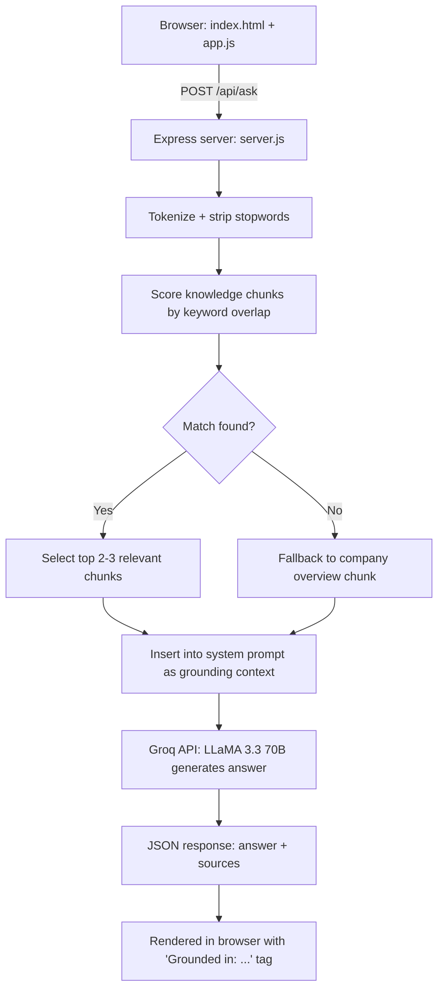

# SafeX Solutions — AI FAQ Assistant

A retrieval-grounded chatbot that answers only from what SafeX actually publishes — never invented.

## Overview

Visitors to [safexsolutions.com](https://safexsolutions.com) have no way to interactively ask about services, mission, or contact info — they have to read through the site manually. This prototype closes that gap with a chatbot that:

- Answers **only** from real SafeX Solutions website content
- Openly declines to invent facts (like pricing) that aren't published
- Shows exactly which knowledge topics each answer was grounded in

Built as an internship AI/ML prototype task. Full write-up, architecture diagrams, and validation screenshots are in [`SafeX_Case_Study.docx`](./SafeX_Case_Study.docx).

## Features

| Feature | Description |
|---|---|
| Retrieval-augmented generation | Keyword-overlap retrieval selects relevant context before generation — no hallucinated answers |
| Groq / LLaMA 3.3 70B | Fast, low-temperature generation tuned for factual consistency |
| Honest fallback | Declines and redirects to `contact@safexsolutions.com` when a question falls outside its knowledge base |
| On-brand UI | White/blue interface matching SafeX's actual site design |
| Source transparency | Every answer is tagged with the knowledge topics it was grounded in |

## Architecture



### How it works

1. User submits a question in the browser.
2. The frontend `POST`s it to `/api/ask`.
3. The backend tokenizes the question and scores it against knowledge base chunks by keyword overlap.
4. The top 2–3 relevant chunks are selected as context (falling back to the company overview if nothing matches).
5. Those chunks are inserted into a system prompt instructing the model to answer **only** from that context.
6. Groq (LLaMA 3.3 70B) generates the answer at low temperature (0.3) for factual consistency.
7. The answer and its source topics are returned and rendered with a `Grounded in: ...` tag.

## Guardrails

The assistant treats its knowledge base as a hard boundary, not a starting point for improvisation. Verified against two live tests:

- **In-domain edge case** — "What are your prices?" → correctly declines to invent a figure, redirects to `contact@safexsolutions.com`
- **Out-of-domain question** — "What's the capital of France?" → recognizes the question is unrelated to SafeX entirely and redirects, rather than force-fitting an answer

Screenshots and full analysis in the case study.

## Setup

```bash
npm install
```

Create a `.env` file in the project root:
GROQ_API_KEY=your_groq_api_key_here

PORT=3000

## Run

```bash
node server.js
```

Then open `http://localhost:3000` in a browser.

> Runs locally only — not yet deployed to a public host.

## Project structure
safex-faq-bot/

├── server.js              Express server, /api/ask route, retrieval logic

├── package.json

├── .env                    GROQ_API_KEY (create yourself, gitignored)

├── .gitignore

├── data/

│   └── knowledge_base.js   SafeX content chunks, sourced from safexsolutions.com

├── public/

│   ├── index.html          Chat UI markup

│   ├── style.css           SafeX-matched white/blue styling

│   └── app.js              Frontend logic, calls /api/ask

└── SafeX_Case_Study.docx  Full write-up: approach, architecture, results, limitations

## Case study

See [`SafeX_Case_Study.docx`](./SafeX_Case_Study.docx) for the complete write-up: problem framing, approach, architecture, retrieval validation, live guardrail tests with screenshots, limitations, and next steps.

## Author

Zarman Sattar (FA23-BAI-053) · BS Artificial Intelligence · COMSATS University Islamabad